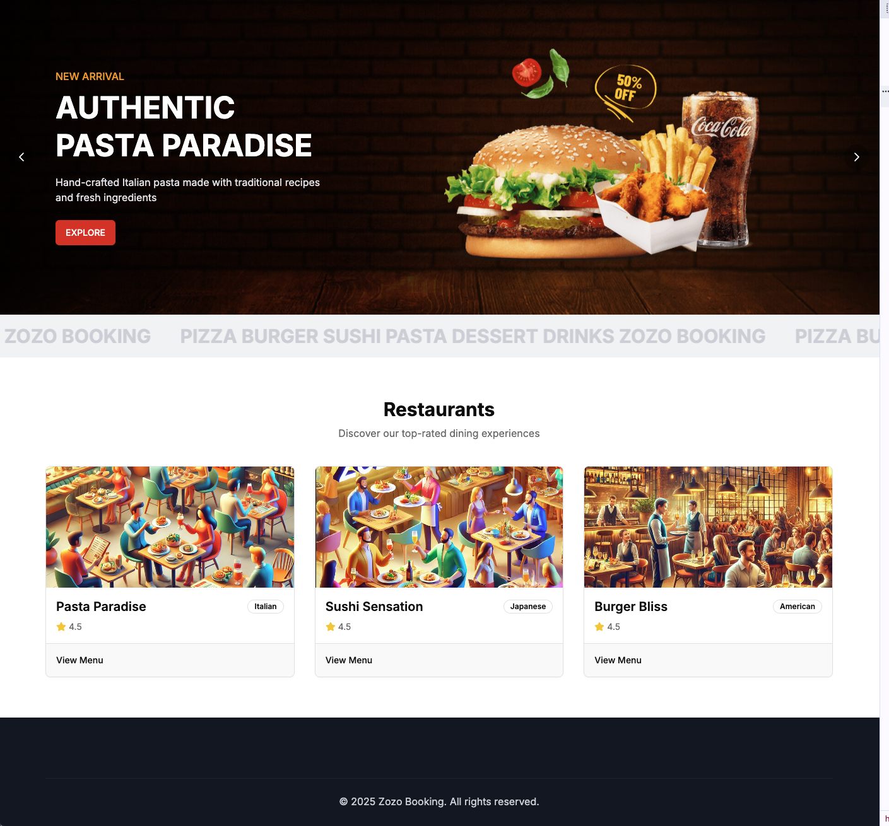
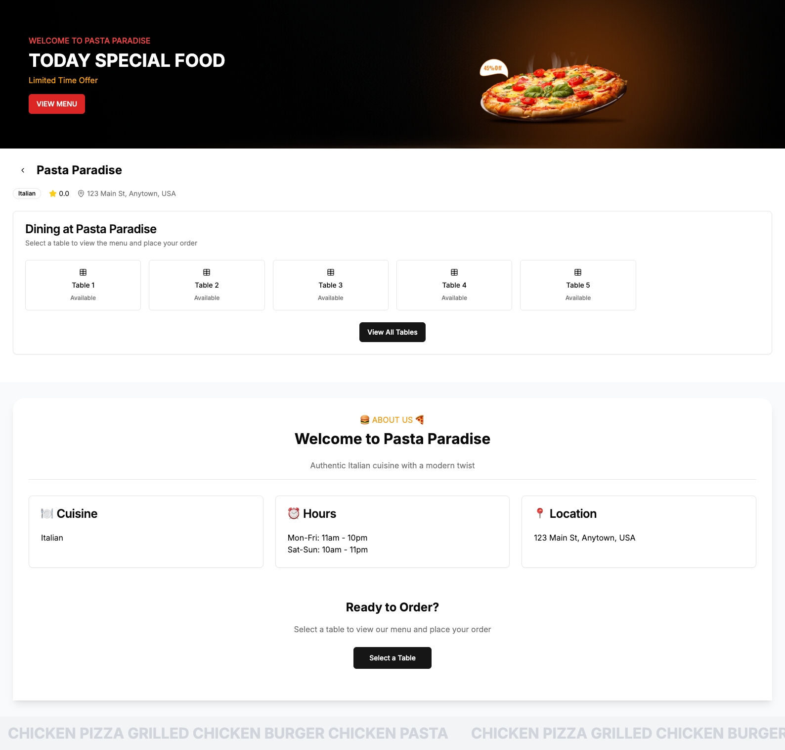
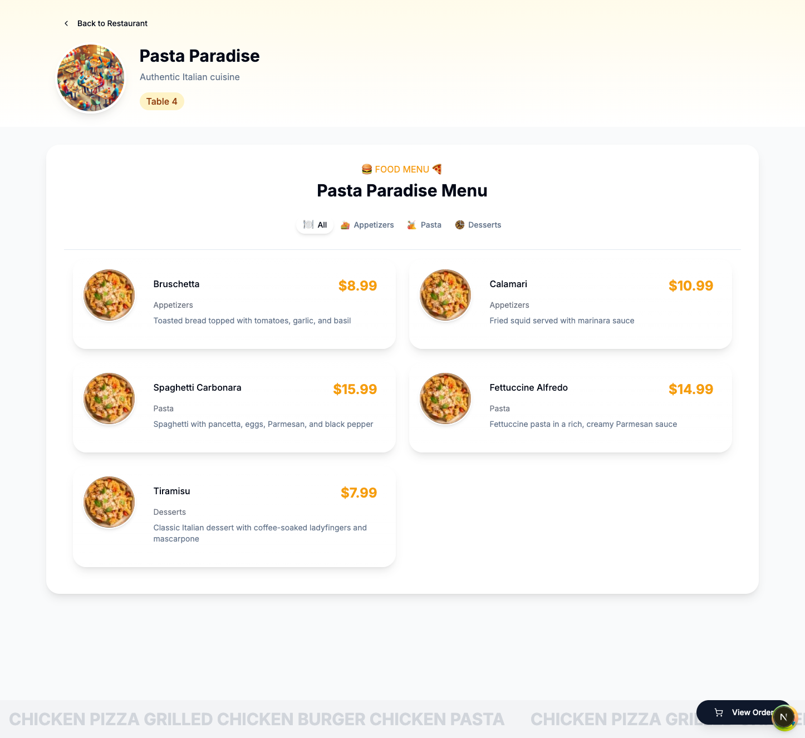
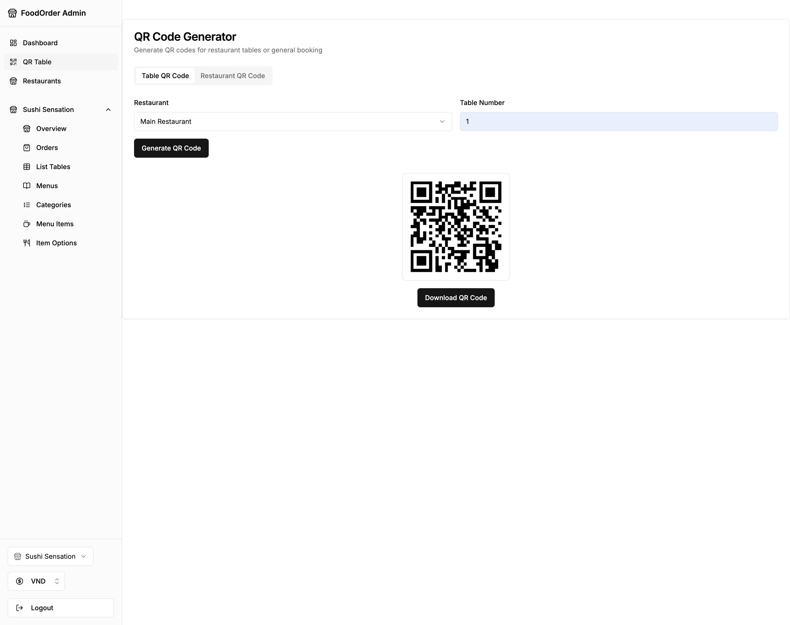
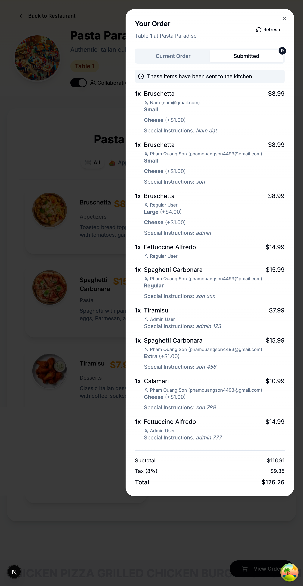

# Next.js template

### Môi trường chạy dự án: Node.js v20.14.0
https://nodejs.org/download/release/v20.14.0/

===

Các bước cài đặt: (chế độ development)
1. clone code
2. cài đặt thư viện: npm i
3. Update file .env.development (nếu cần thiết)
4. Chạy dự án: npm run dev

===

Cách chạy tại chế độ production:
1. clone code
2. cài đặt thư viện: npm i
3. Update file .env.production (nếu cần thiết)
4. Build dự án: npm run build
5. Chạy dự án: npm run preview

Install database example: node --loader ts-node/esm prisma/seed.ts 
Not use: npx prisma db drop --force
1. Run Migrations: npx prisma migrate dev --name init
2. Run Seed: node --loader ts-node/esm prisma/seed.ts

```
📂 restaurant-ordering
├── 📂 app
│   └── 📂 api
│       ├── 📂 auth (Xử lý đăng nhập admin)
│       ├── 📂 orders (CRUD đơn hàng)
│       ├── 📂 resta    urants (Danh sách nhà hàng, menu)
│       └── 📂 likes (Thích và đánh giá món ăn)
├── 📂 components (Re-usable UI với ShadCN & Tailwind)
├── 📂 lib (Chứa Prisma client, helpers)
├── 📂 prisma (Schema database & migrations)
├── 📂 public (Chứa ảnh menu, icon, assets)
├── 📂 styles (Global styles)
├── 📂 utils (Các hàm utility)
├── 📜 .env (Biến môi trường)
├── 📜 next.config.js
├── 📜 package.json
├── 📜 prisma/schema.prisma (Schema DB)
└── 📜 tailwind.config.js
```

===
1. An admin user (email: [admin@example.com](mailto:admin@example.com), password: admin123)
2. A regular user (email: [user@example.com](mailto:user@example.com), password: user123)
3. A sample restaurant

<div align="center">
    
</div>
<div align="center">
    
</div>
<div align="center">
    
</div>
<div align="center">
    
</div>
<div align="center">
    
</div>